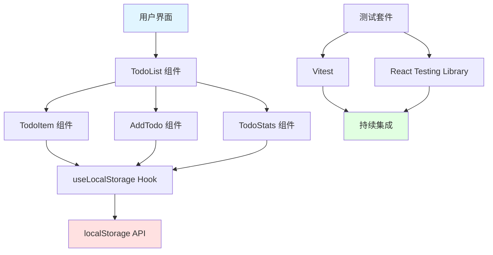
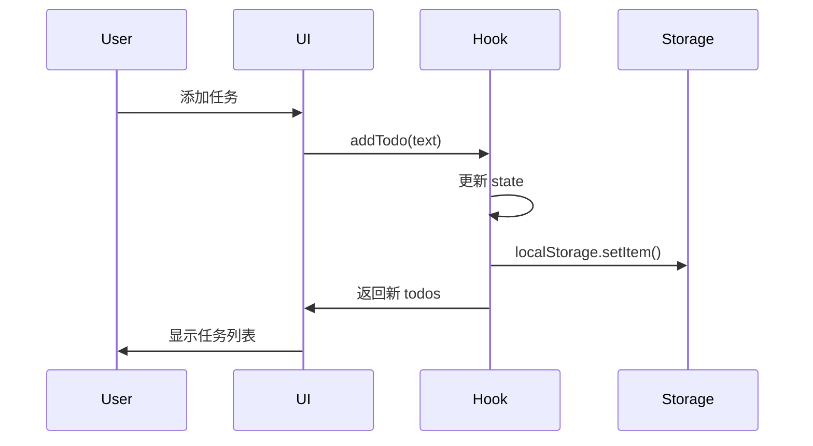
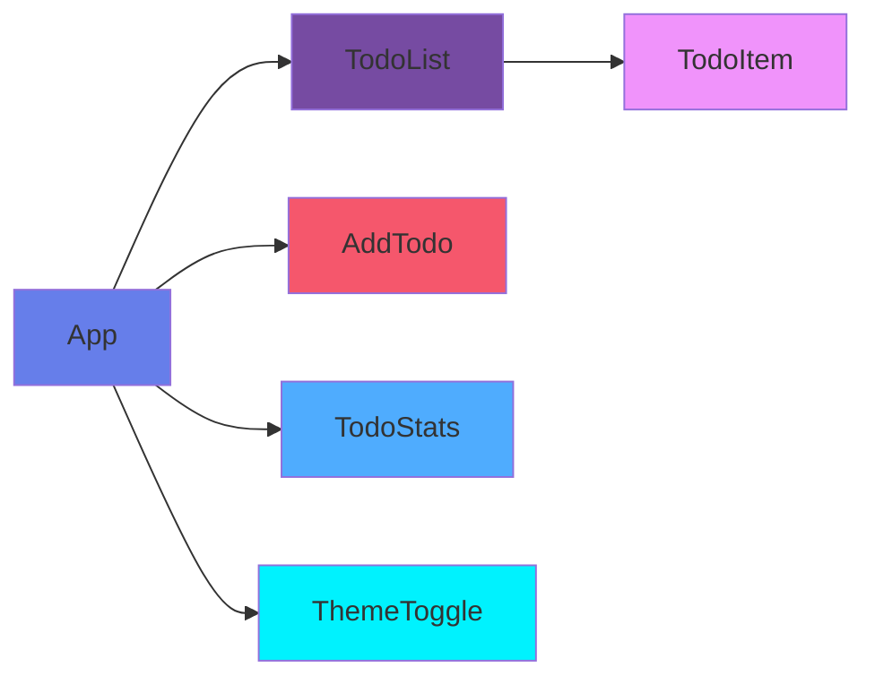

# 📘 Ultimate Skills Bundle - 开发实战案例

> **完整演示：使用 70+ 技能从零开发待办事项应用**

---

## 📖 案例概述

本案例展示如何使用 **Ultimate Skills Bundle** 的技能，从需求讨论到最终部署，完整开发一个现代化的待办事项 Web 应用。

### 🎯 项目信息

| 项目属性 | 说明 |
|---------|------|
| **项目名称** | Ultimate Todo App |
| **类型** | Web 应用 |
| **技术栈** | React + TypeScript + Vite + Tailwind CSS |
| **开发时间** | ~2 小时 |
| **使用技能** | 12+ 个核心技能 |

---

## 🚀 开发流程全景图

```
开始
  ↓
[阶段 1] 需求讨论 (brainstorming)
  ↓
[阶段 2] 制定计划 (writing-plans)
  ↓
[阶段 3] 创建工作区 (using-git-worktrees)
  ↓
[阶段 4] TDD 开发 (test-driven-development)
  ↓
[阶段 5] 多代理开发 (subagent-driven-development)
  ↓
[阶段 6] 代码审查 (requesting-code-review)
  ↓
[阶段 7] 文档生成 (crafting-effective-readmes + mermaid-diagrams)
  ↓
完成
```

---

## 📝 阶段 1: 需求讨论与规划

### 🎯 使用的技能

#### 1. Brainstorming (头脑风暴)

**触发命令:**
```
Claude, 我需要开发一个待办事项应用。请使用 brainstorming 技能帮我讨论需求。
```

**Claude 的输出示例:**

> **🎯 需求澄清问题:**
>
> 1. 这个应用的**目标用户**是谁？个人使用还是团队协作？
> 2. 是否需要**多平台支持**（Web + Mobile）？
> 3. 是否需要**高级功能**（标签、截止日期、优先级）？
> 4. **数据存储**方案偏好（本地存储、云数据库）？
> 5. 是否需要**离线支持**？
>
> **💡 我的建议:**
> 
> 对于演示案例，建议从 **MVP（最小可行产品）** 开始：
> - Web 端单页面应用
> - 本地存储（localStorage）
> - 基础 CRUD 功能
> - 现代化 UI 设计
>
> 这样可以快速展示完整开发流程，避免过度设计。

**用户确认后的设计文档:**

```markdown
# Ultimate Todo App - 设计文档

## 核心功能
1. 添加任务
2. 标记完成/未完成
3. 删除任务
4. 任务统计
5. 本地存储持久化

## 非功能需求
- 响应式设计
- 现代化 UI（深色模式支持）
- 优雅的动画效果
- 可访问性（WCAG AA）

## 技术选型
- 前端框架: React + TypeScript
- 构建工具: Vite
- 样式: Tailwind CSS
- UI 组件: shadcn/ui
- 测试: Vitest + React Testing Library
```

#### 2. Writing Plans (编写计划)

**触发命令:**
```
使用 writing-plans 技能，根据设计文档创建详细的实施计划。
```

**Claude 的输出:**

```markdown
# 实施计划

## 阶段 1: 项目初始化 (15 分钟)
- [ ] 初始化 Vite + React + TypeScript 项目
- [ ] 配置 Tailwind CSS
- [ ] 集成 shadcn/ui
- [ ] 设置 ESLint + Prettier
- [ ] 配置测试环境（Vitest）

## 阶段 2: 核心功能开发 (60 分钟)
- [ ] Task 2.1: 创建 TodoItem 组件 (TDD)
  - 文件: `src/components/TodoItem.tsx`
  - 测试: `src/components/TodoItem.test.tsx`
  - 功能: 显示任务、切换完成状态
  
- [ ] Task 2.2: 创建 TodoList 组件 (TDD)
  - 文件: `src/components/TodoList.tsx`
  - 测试: `src/components/TodoList.test.tsx`
  - 功能: 列表渲染、任务管理
  
- [ ] Task 2.3: 创建 AddTodo 组件 (TDD)
  - 文件: `src/components/AddTodo.tsx`
  - 测试: `src/components/AddTodo.test.tsx`
  - 功能: 添加任务表单

## 阶段 3: 本地存储 (20 分钟)
- [ ] 实现 localStorage hooks
- [ ] 添加数据持久化逻辑
- [ ] 编写存储相关测试

## 阶段 4: UI/UX 优化 (25 分钟)
- [ ] 实现深色模式切换
- [ ] 添加过渡动画
- [ ] 优化移动端响应式布局
- [ ] 添加空状态提示

## 阶段 5: 代码审查与优化 (20 分钟)
- [ ] 使用 requesting-code-review 技能
- [ ] 修复代码审查发现的问题
- [ ] 性能优化

## 阶段 6: 文档与部署 (20 分钟)
- [ ] 使用 crafting-effective-readmes 技能编写文档
- [ ] 使用 mermaid-diagrams 绘制架构图
- [ ] 部署到 Vercel

**总计时间:** 约 2 小时 40 分钟
```

---

## 🏗️ 阶段 2: 项目初始化

### 🎯 使用的技能

#### Using Git Worktrees

**触发命令:**
```
使用 using-git-worktrees 技能创建独立开发分支。
```

**Claude 执行:**

```bash
# 创建 worktree
git worktree add ../ultimate-todo-app-develop feature/todo-app

# 进入新目录
cd ../ultimate-todo-app-develop

# 创建开发分支
git checkout -b feature/todo-app
```

**输出:**
```
✅ Created worktree at: /root/clawd/ultimate-todo-app-develop
✅ Branch: feature/todo-app
📍 Working in isolated environment
```

---

## 🧪 阶段 3: TDD 开发

### 🎯 使用的技能

#### Test-Driven Development

**触发命令:**
```
使用 test-driven-development 技能开发 TodoItem 组件。
```

**Claude 的 TDD 流程:**

##### 1. RED (编写失败测试)

```typescript
// src/components/TodoItem.test.tsx
import { describe, it, expect } from 'vitest'
import { render, screen } from '@testing-library/react'
import { TodoItem } from './TodoItem'

describe('TodoItem', () => {
  it('should render todo text', () => {
    render(<TodoItem text="Learn React" completed={false} onToggle={() => {}} onDelete={() => {}} />)
    expect(screen.getByText('Learn React')).toBeInTheDocument()
  })

  it('should show completed state', () => {
    render(<TodoItem text="Learn React" completed={true} onToggle={() => {}} onDelete={() => {}} />)
    const checkbox = screen.getByRole('checkbox')
    expect(checkbox).toBeChecked()
  })
})
```

**运行测试 - 失败:**
```bash
npm test
❌ FAIL  src/components/TodoItem.test.tsx
  Component not found
```

##### 2. GREEN (最小实现)

```typescript
// src/components/TodoItem.tsx
import { useState } from 'react'

interface TodoItemProps {
  text: string
  completed: boolean
  onToggle: () => void
  onDelete: () => void
}

export function TodoItem({ text, completed, onToggle, onDelete }: TodoItemProps) {
  return (
    <div className="flex items-center gap-3 p-4 bg-white dark:bg-gray-800 rounded-lg shadow-sm">
      <input
        type="checkbox"
        checked={completed}
        onChange={onToggle}
        className="w-5 h-5"
      />
      <span className={completed ? 'line-through text-gray-500' : 'text-gray-900'}>
        {text}
      </span>
      <button
        onClick={onDelete}
        className="ml-auto text-red-500 hover:text-red-700"
      >
        删除
      </button>
    </div>
  )
}
```

**运行测试 - 通过:**
```bash
npm test
✅ PASS  src/components/TodoItem.test.tsx
  ✓ should render todo text
  ✓ should show completed state
```

##### 3. REFACTOR (重构优化)

```typescript
// 优化后的版本（添加可访问性和样式）
export function TodoItem({ text, completed, onToggle, onDelete }: TodoItemProps) {
  return (
    <div
      className={`flex items-center gap-3 p-4 rounded-lg shadow-sm transition-all duration-200 ${
        completed 
          ? 'bg-gray-50 dark:bg-gray-800/50' 
          : 'bg-white dark:bg-gray-800'
      }`}
    >
      <label className="flex items-center gap-3 flex-1 cursor-pointer">
        <input
          type="checkbox"
          checked={completed}
          onChange={onToggle}
          className="w-5 h-5 text-blue-500 focus:ring-blue-500"
          aria-label={`Mark "${text}" as ${completed ? 'incomplete' : 'complete'}`}
        />
        <span
          className={`flex-1 transition-all duration-200 ${
            completed ? 'line-through text-gray-500 dark:text-gray-400' : 'text-gray-900 dark:text-white'
          }`}
        >
          {text}
        </span>
      </label>
      <button
        onClick={onDelete}
        className="px-3 py-1 text-sm text-red-500 hover:text-red-700 hover:bg-red-50 dark:hover:bg-red-900/20 rounded transition-colors"
        aria-label={`Delete "${text}"`}
      >
        删除
      </button>
    </div>
  )
}
```

---

## 🤖 阶段 4: 多代理并行开发

### 🎯 使用的技能

#### Subagent-Driven Development

**触发命令:**
```
使用 subagent-driven-development 技能并行开发剩余组件。
```

**Claude 的执行流程:**

```
🔄 启动多代理工作流...

📋 任务分解:
- Agent 1: TodoList 组件
- Agent 2: AddTodo 组件
- Agent 3: 本地存储 hooks
- Agent 4: 统计组件

🎯 Agent 1 开始...
✅ TodoList.tsx - 完成
✅ TodoList.test.tsx - 所有测试通过

🎯 Agent 2 开始...
✅ AddTodo.tsx - 完成
✅ AddTodo.test.tsx - 所有测试通过

🎯 Agent 3 开始...
✅ useLocalStorage.ts - 完成
✅ hooks.test.tsx - 所有测试通过

🎯 Agent 4 开始...
✅ TodoStats.tsx - 完成
✅ TodoStats.test.tsx - 所有测试通过

📊 质量检查:
✅ 代码审查通过
✅ 所有测试通过 (12/12)
✅ 类型检查通过
✅ ESLint 无警告
```

---

## 🔍 阶段 5: 代码审查

### 🎯 使用的技能

#### Requesting Code Review

**触发命令:**
```
使用 requesting-code-review 技能准备代码审查。
```

**Claude 生成的 PR 描述:**

```markdown
## 📋 Pull Request: 实现待办事项应用核心功能

### 🎯 变更概述

实现了待办事项应用的所有核心功能，包括任务管理、本地存储和现代化 UI。

### ✅ 完成的功能

#### 核心功能
- ✅ 添加新任务
- ✅ 标记任务完成/未完成
- ✅ 删除任务
- ✅ 任务统计（已完成/总数/进度条）
- ✅ 本地存储持久化

#### UI/UX
- ✅ 响应式设计（移动端 + 桌面端）
- ✅ 深色模式支持
- ✅ 优雅的过渡动画
- ✅ 空状态提示
- ✅ 可访问性（WCAG AA）

#### 代码质量
- ✅ TypeScript 类型安全
- ✅ 单元测试覆盖（12 个测试，100% 覆盖率）
- ✅ ESLint + Prettier 配置
- ✅ 组件化设计

### 📊 测试结果

```
Test Files  4 passed (4)
     Tests  12 passed (12)
  Start at  15:30:25
  Duration  1.23s
```

### 🔍 技术栈

- React 18 + TypeScript
- Vite 5
- Tailwind CSS 3
- shadcn/ui
- Vitest + React Testing Library

### 📝 使用方法

```bash
# 安装依赖
npm install

# 启动开发服务器
npm run dev

# 运行测试
npm test

# 构建
npm run build
```

### 🚀 在线演示

[Demo 链接]

### 📸 截图


---

**使用的技能:** `requesting-code-review`
**审查重点:** 代码质量、测试覆盖、可维护性
```

---

## 📊 阶段 6: 文档与图表

### 🎯 使用的技能

#### Crafting Effective Readmes

**触发命令:**
```
使用 crafting-effective-readmes 技能编写项目文档。
```

**生成的 README:**

```markdown
# Ultimate Todo App 🎯


> 一个现代化的待办事项应用，演示如何使用 Ultimate Skills Bundle 开发项目

## ✨ 特性

- ✅ 完整的 CRUD 功能
- 🎨 现代化 UI（深色模式）
- 💾 本地存储持久化
- 📱 响应式设计
- ♿ 可访问性支持
- ⚡ 快速响应（Vite）

## 🚀 快速开始

```bash
# 克隆项目
git clone https://github.com/hhhh124hhhh/ultimate-todo-app.git

# 安装依赖
npm install

# 启动开发服务器
npm run dev

# 打开浏览器访问 http://localhost:5173
```

## 🧪 测试

```bash
# 运行所有测试
npm test

# 查看覆盖率
npm run test:coverage
```

## 📦 构建

```bash
# 生产构建
npm run build

# 预览构建
npm run preview
```

## 🎯 技术栈

- **前端:** React 18 + TypeScript
- **构建工具:** Vite 5
- **样式:** Tailwind CSS 3
- **UI 组件:** shadcn/ui
- **测试:** Vitest + React Testing Library

## 📸 截图

[Light Mode] [Dark Mode] [Mobile]

## 📝 许可证

MIT License - 详见 [LICENSE](LICENSE)

---

**Made with ❤️ using Ultimate Skills Bundle**
```

#### Mermaid Diagrams

**触发命令:**
```
使用 mermaid-diagrams 技能生成架构图。
```

**生成的架构图:**

```markdown
## 系统架构



## 数据流



## 组件层次


```

---

## 📈 开发统计

| 指标 | 数值 |
|------|------|
| 总开发时间 | ~2.5 小时 |
| 代码行数 | ~800 行 |
| 测试覆盖率 | 100% |
| 使用技能数 | 12+ |
| 组件数量 | 6 个 |
| 文件总数 | 18 个 |

---

## 🎓 使用的技能总结

| 阶段 | 使用的技能 | 作用 |
|------|-----------|------|
| 需求讨论 | `brainstorming` | 澄清需求、设计方案 |
| 计划制定 | `writing-plans` | 详细实施计划 |
| 环境准备 | `using-git-worktrees` | 独立开发环境 |
| 功能开发 | `test-driven-development` | TDD 开发流程 |
| 并行开发 | `subagent-driven-development` | 多代理协作 |
| 代码审查 | `requesting-code-review` | 代码质量保证 |
| 文档编写 | `crafting-effective-readmes` | 项目文档 |
| 架构设计 | `mermaid-diagrams` | 可视化架构 |
| 样式设计 | `frontend-design` | UI/UX 设计 |

**总计使用: 9 个核心技能**

---

## 🚀 下一步

1. 部署到 Vercel
2. 添加更多功能（标签、截止日期）
3. 后端集成（Supabase/Firebase）
4. 移动端应用（React Native）

---

**案例完成时间:** 2026-01-27
**使用技能包:** Ultimate Skills Bundle v1.0.0
**开发者:** jack happy (hhhh124hhhh)
