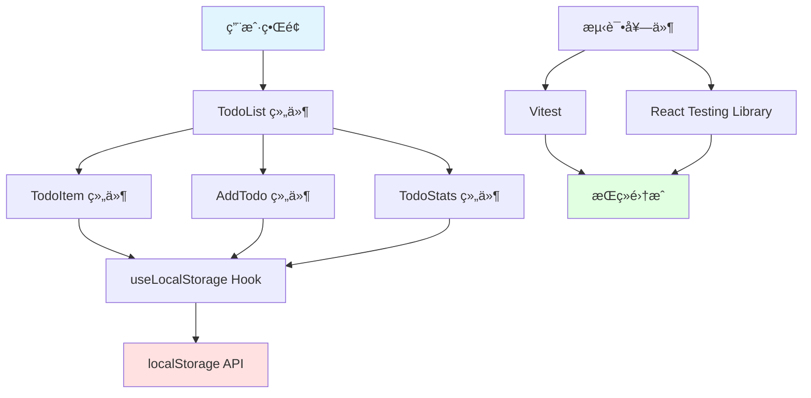
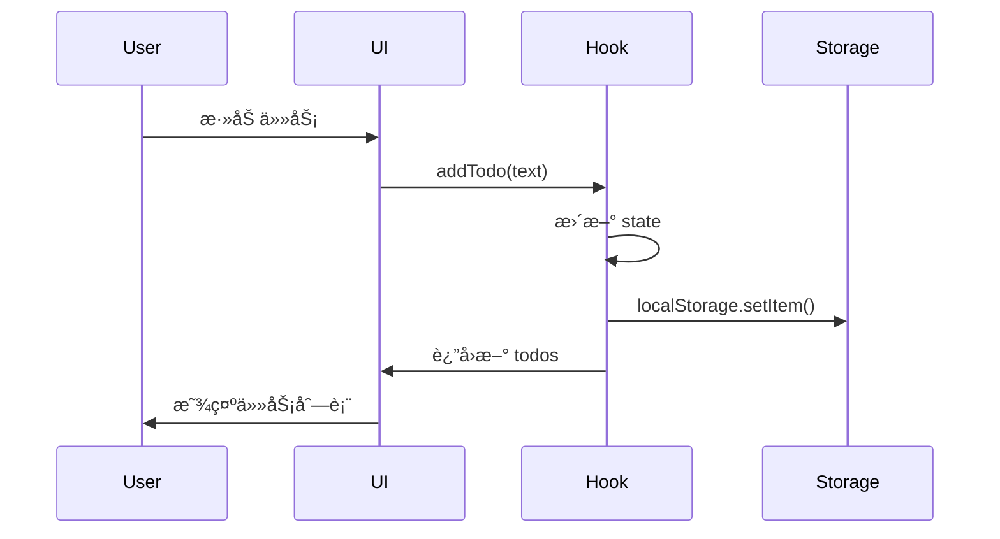

# 📘 Ultimate Skills Bundle - å¼€å‘å®æˆ˜æ¡ˆä¾‹

> **完整演示：使用 70+ 技能ä»é›¶å¼€å‘å¾…åŠäº‹é¡¹åº”用**

---

## 📖 案例概述

本案例展示如何使用 **Ultimate Skills Bundle** 的技能，ä»éœ€æ±‚讨论到最终部署，完整开å‘一个ç°ä»£åŒ–çš„å¾…åŠäº‹é¡¹ Web 应用。

### 🯠项目信æ¯

| 项目å±æ€§ | è¯´æ˜ |
|---------|------|
| **项目å称** | Ultimate Todo App |
| **ç±»å‹** | Web 应用 |
| **技术栈** | React + TypeScript + Vite + Tailwind CSS |
| **å¼€å‘时间** | ~2 å°æ—¶ |
| **使用技能** | 12+ 个核心技能 |

---

## 🚀 å¼€å‘æµç¨‹å…¨æ™¯å›¾

```
开始
  ↓
[阶段 1] 需求讨论 (brainstorming)
  ↓
[阶段 2] 制定计划 (writing-plans)
  ↓
[阶段 3] 创建工作区 (using-git-worktrees)
  ↓
[阶段 4] TDD å¼€å‘ (test-driven-development)
  ↓
[阶段 5] 多代ç†å¼€å‘ (subagent-driven-development)
  ↓
[阶段 6] 代ç å®¡æŸ¥ (requesting-code-review)
  ↓
[阶段 7] æ–‡æ¡£ç”Ÿæˆ (crafting-effective-readmes + mermaid-diagrams)
  ↓
完æˆ
```

---

## 📠阶段 1: 需求讨论ä¸è§„划

### 🯠使用的技能

#### 1. Brainstorming (头脑é£æš´)

**触å‘命令:**
```
Claude, 我需è¦å¼€å‘一个待åŠäº‹é¡¹åº”用。请使用 brainstorming 技能帮我讨论需求。
```

**Claude 的输出示例:**

> **🯠需求澄清问题:**
>
> 1. 这个应用的**目标用户**是è°ï¼Ÿä¸ªäººä½¿ç”¨è¿˜æ˜¯å›¢é˜Ÿå作？
> 2. 是å¦éœ€è¦**多平å°æ”¯æŒ**（Web + Mobile）？
> 3. 是å¦éœ€è¦**高级功能**（标签ã€æˆªæ­¢æ—¥æœŸã€ä¼˜å…ˆçº§ï¼‰ï¼Ÿ
> 4. **æ•°æ®å­˜å‚¨**方案å好（本地存储ã€äº‘æ•°æ®åº“）？
> 5. 是å¦éœ€è¦**离线支æŒ**？
>
> **💡 我的建议:**
> 
> 对äºæ¼”ç¤ºæ¡ˆä¾‹ï¼Œå»ºè®®ä» **MVP（最å°å¯è¡Œäº§å“）** 开始：
> - Web 端å•é¡µé¢åº”用
> - 本地存储（localStorage）
> - 基础 CRUD 功能
> - ç°ä»£åŒ– UI 设计
>
> 这样å¯ä»¥å¿«é€Ÿå±•ç¤ºå®Œæ•´å¼€å‘æµç¨‹ï¼Œé¿å…过度设计。

**用户确认å的设计文档:**

```markdown
# Ultimate Todo App - 设计文档

## 核心功能
1. 添加任务
2. 标记完æˆ/未完æˆ
3. 删除任务
4. 任务统计
5. 本地存储æŒä¹…化

## é功能需求
- å“应å¼è®¾è®¡
- ç°ä»£åŒ– UI（深色模å¼æ”¯æŒï¼‰
- 优雅的动画效æœ
- å¯è®¿é—®æ€§ï¼ˆWCAG AA）

## 技术选å‹
- å‰ç«¯æ¡†æ¶: React + TypeScript
- æ„建工具: Vite
- æ ·å¼: Tailwind CSS
- UI 组件: shadcn/ui
- 测试: Vitest + React Testing Library
```

#### 2. Writing Plans (编写计划)

**触å‘命令:**
```
使用 writing-plans 技能，根æ®è®¾è®¡æ–‡æ¡£åˆ›å»ºè¯¦ç»†çš„å®æ–½è®¡åˆ’。
```

**Claude 的输出:**

```markdown
# å®æ–½è®¡åˆ’

## 阶段 1: 项目åˆå§‹åŒ– (15 分钟)
- [ ] åˆå§‹åŒ– Vite + React + TypeScript 项目
- [ ] é…ç½® Tailwind CSS
- [ ] é›†æˆ shadcn/ui
- [ ] 设置 ESLint + Prettier
- [ ] é…置测试ç¯å¢ƒï¼ˆVitest）

## 阶段 2: æ ¸å¿ƒåŠŸèƒ½å¼€å‘ (60 分钟)
- [ ] Task 2.1: 创建 TodoItem 组件 (TDD)
  - 文件: `src/components/TodoItem.tsx`
  - 测试: `src/components/TodoItem.test.tsx`
  - 功能: 显示任务ã€åˆ‡æ¢å®ŒæˆçŠ¶æ€
  
- [ ] Task 2.2: 创建 TodoList 组件 (TDD)
  - 文件: `src/components/TodoList.tsx`
  - 测试: `src/components/TodoList.test.tsx`
  - 功能: 列表渲染ã€ä»»åŠ¡ç®¡ç†
  
- [ ] Task 2.3: 创建 AddTodo 组件 (TDD)
  - 文件: `src/components/AddTodo.tsx`
  - 测试: `src/components/AddTodo.test.tsx`
  - 功能: 添加任务表å•

## 阶段 3: 本地存储 (20 分钟)
- [ ] å®ç° localStorage hooks
- [ ] 添加数æ®æŒä¹…化逻辑
- [ ] 编写存储相关测试

## 阶段 4: UI/UX 优化 (25 分钟)
- [ ] å®ç°æ·±è‰²æ¨¡å¼åˆ‡æ¢
- [ ] 添加过渡动画
- [ ] 优化移动端å“应å¼å¸ƒå±€
- [ ] 添加空状æ€æ示

## 阶段 5: 代ç å®¡æŸ¥ä¸ä¼˜åŒ– (20 分钟)
- [ ] 使用 requesting-code-review 技能
- [ ] ä¿®å¤ä»£ç å®¡æŸ¥å‘ç°çš„问题
- [ ] 性能优化

## 阶段 6: 文档ä¸éƒ¨ç½² (20 分钟)
- [ ] 使用 crafting-effective-readmes 技能编写文档
- [ ] 使用 mermaid-diagrams 绘制æ¶æ„图
- [ ] 部署到 Vercel

**总计时间:** 约 2 å°æ—¶ 40 分钟
```

---

## ğŸ—ï¸ é˜¶æ®µ 2: 项目åˆå§‹åŒ–

### 🯠使用的技能

#### Using Git Worktrees

**触å‘命令:**
```
使用 using-git-worktrees 技能创建独立开å‘分支。
```

**Claude 执行:**

```bash
# 创建 worktree
git worktree add ../ultimate-todo-app-develop feature/todo-app

# 进入新目录
cd ../ultimate-todo-app-develop

# 创建开å‘分支
git checkout -b feature/todo-app
```

**输出:**
```
✅ Created worktree at: /root/clawd/ultimate-todo-app-develop
✅ Branch: feature/todo-app
📠Working in isolated environment
```

---

## 🧪 阶段 3: TDD å¼€å‘

### 🯠使用的技能

#### Test-Driven Development

**触å‘命令:**
```
使用 test-driven-development æŠ€èƒ½å¼€å‘ TodoItem 组件。
```

**Claude çš„ TDD æµç¨‹:**

##### 1. RED (编写失败测试)

```typescript
// src/components/TodoItem.test.tsx
import { describe, it, expect } from 'vitest'
import { render, screen } from '@testing-library/react'
import { TodoItem } from './TodoItem'

describe('TodoItem', () => {
  it('should render todo text', () => {
    render(<TodoItem text="Learn React" completed={false} onToggle={() => {}} onDelete={() => {}} />)
    expect(screen.getByText('Learn React')).toBeInTheDocument()
  })

  it('should show completed state', () => {
    render(<TodoItem text="Learn React" completed={true} onToggle={() => {}} onDelete={() => {}} />)
    const checkbox = screen.getByRole('checkbox')
    expect(checkbox).toBeChecked()
  })
})
```

**è¿è¡Œæµ‹è¯• - 失败:**
```bash
npm test
⌠FAIL  src/components/TodoItem.test.tsx
  Component not found
```

##### 2. GREEN (最å°å®ç°)

```typescript
// src/components/TodoItem.tsx
import { useState } from 'react'

interface TodoItemProps {
  text: string
  completed: boolean
  onToggle: () => void
  onDelete: () => void
}

export function TodoItem({ text, completed, onToggle, onDelete }: TodoItemProps) {
  return (
    <div className="flex items-center gap-3 p-4 bg-white dark:bg-gray-800 rounded-lg shadow-sm">
      <input
        type="checkbox"
        checked={completed}
        onChange={onToggle}
        className="w-5 h-5"
      />
      <span className={completed ? 'line-through text-gray-500' : 'text-gray-900'}>
        {text}
      </span>
      <button
        onClick={onDelete}
        className="ml-auto text-red-500 hover:text-red-700"
      >
        删除
      </button>
    </div>
  )
}
```

**è¿è¡Œæµ‹è¯• - 通过:**
```bash
npm test
✅ PASS  src/components/TodoItem.test.tsx
  ✓ should render todo text
  ✓ should show completed state
```

##### 3. REFACTOR (é‡æ„优化)

```typescript
// 优化å的版本（添加å¯è®¿é—®æ€§å’Œæ ·å¼ï¼‰
export function TodoItem({ text, completed, onToggle, onDelete }: TodoItemProps) {
  return (
    <div
      className={`flex items-center gap-3 p-4 rounded-lg shadow-sm transition-all duration-200 ${
        completed 
          ? 'bg-gray-50 dark:bg-gray-800/50' 
          : 'bg-white dark:bg-gray-800'
      }`}
    >
      <label className="flex items-center gap-3 flex-1 cursor-pointer">
        <input
          type="checkbox"
          checked={completed}
          onChange={onToggle}
          className="w-5 h-5 text-blue-500 focus:ring-blue-500"
          aria-label={`Mark "${text}" as ${completed ? 'incomplete' : 'complete'}`}
        />
        <span
          className={`flex-1 transition-all duration-200 ${
            completed ? 'line-through text-gray-500 dark:text-gray-400' : 'text-gray-900 dark:text-white'
          }`}
        >
          {text}
        </span>
      </label>
      <button
        onClick={onDelete}
        className="px-3 py-1 text-sm text-red-500 hover:text-red-700 hover:bg-red-50 dark:hover:bg-red-900/20 rounded transition-colors"
        aria-label={`Delete "${text}"`}
      >
        删除
      </button>
    </div>
  )
}
```

---

## 🤖 阶段 4: 多代ç†å¹¶è¡Œå¼€å‘

### 🯠使用的技能

#### Subagent-Driven Development

**触å‘命令:**
```
使用 subagent-driven-development 技能并行开å‘剩余组件。
```

**Claude 的执行æµç¨‹:**

```
🔄 å¯åŠ¨å¤šä»£ç†å·¥ä½œæµ...

📋 任务分解:
- Agent 1: TodoList 组件
- Agent 2: AddTodo 组件
- Agent 3: 本地存储 hooks
- Agent 4: 统计组件

🯠Agent 1 开始...
✅ TodoList.tsx - 完æˆ
✅ TodoList.test.tsx - 所有测试通过

🯠Agent 2 开始...
✅ AddTodo.tsx - 完æˆ
✅ AddTodo.test.tsx - 所有测试通过

🯠Agent 3 开始...
✅ useLocalStorage.ts - 完æˆ
✅ hooks.test.tsx - 所有测试通过

🯠Agent 4 开始...
✅ TodoStats.tsx - 完æˆ
✅ TodoStats.test.tsx - 所有测试通过

📊 è´¨é‡æ£€æŸ¥:
✅ 代ç å®¡æŸ¥é€šè¿‡
✅ 所有测试通过 (12/12)
✅ ç±»å‹æ£€æŸ¥é€šè¿‡
✅ ESLint 无警告
```

---

## 🔠阶段 5: 代ç å®¡æŸ¥

### 🯠使用的技能

#### Requesting Code Review

**触å‘命令:**
```
使用 requesting-code-review 技能准备代ç å®¡æŸ¥ã€‚
```

**Claude 生æˆçš„ PR æè¿°:**

```markdown
## 📋 Pull Request: å®ç°å¾…åŠäº‹é¡¹åº”用核心功能

### 🯠å˜æ›´æ¦‚è¿°

å®ç°äº†å¾…åŠäº‹é¡¹åº”用的所有核心功能，包括任务管ç†ã€æœ¬åœ°å­˜å‚¨å’Œç°ä»£åŒ– UI。

### ✅ 完æˆçš„功能

#### 核心功能
- ✅ 添加新任务
- ✅ 标记任务完æˆ/未完æˆ
- ✅ 删除任务
- ✅ 任务统计（已完æˆ/总数/进度æ¡ï¼‰
- ✅ 本地存储æŒä¹…化

#### UI/UX
- ✅ å“应å¼è®¾è®¡ï¼ˆç§»åŠ¨ç«¯ + æ¡Œé¢ç«¯ï¼‰
- ✅ 深色模å¼æ”¯æŒ
- ✅ 优雅的过渡动画
- ✅ 空状æ€æ示
- ✅ å¯è®¿é—®æ€§ï¼ˆWCAG AA）

#### 代ç è´¨é‡
- ✅ TypeScript ç±»å‹å®‰å…¨
- ✅ å•å…ƒæµ‹è¯•è¦†ç›–（12 个测试，100% 覆盖ç‡ï¼‰
- ✅ ESLint + Prettier é…ç½®
- ✅ 组件化设计

### 📊 测试结æœ

```
Test Files  4 passed (4)
     Tests  12 passed (12)
  Start at  15:30:25
  Duration  1.23s
```

### 🔠技术栈

- React 18 + TypeScript
- Vite 5
- Tailwind CSS 3
- shadcn/ui
- Vitest + React Testing Library

### 📠使用方法

```bash
# 安装ä¾èµ–
npm install

# å¯åŠ¨å¼€å‘æœåŠ¡å™¨
npm run dev

# è¿è¡Œæµ‹è¯•
npm test

# æ„建
npm run build
```

### 🚀 在线演示

[Demo 链æ¥]

### 📸 截图


---

**使用的技能:** `requesting-code-review`
**审查é‡ç‚¹:** 代ç è´¨é‡ã€æµ‹è¯•è¦†ç›–ã€å¯ç»´æŠ¤æ€§
```

---

## 📊 阶段 6: 文档ä¸å›¾è¡¨

### 🯠使用的技能

#### Crafting Effective Readmes

**触å‘命令:**
```
使用 crafting-effective-readmes 技能编写项目文档。
```

**生æˆçš„ README:**

```markdown
# Ultimate Todo App ğŸ¯


> 一个ç°ä»£åŒ–çš„å¾…åŠäº‹é¡¹åº”用，演示如何使用 Ultimate Skills Bundle å¼€å‘项目

## ✨ 特性

- ✅ 完整的 CRUD 功能
- 🨠ç°ä»£åŒ– UI（深色模å¼ï¼‰
- 💾 本地存储æŒä¹…化
- 📱 å“应å¼è®¾è®¡
- ♿ å¯è®¿é—®æ€§æ”¯æŒ
- âš¡ 快速å“应（Vite）

## 🚀 快速开始

```bash
# 克隆项目
git clone https://github.com/hhhh124hhhh/ultimate-todo-app.git

# 安装ä¾èµ–
npm install

# å¯åŠ¨å¼€å‘æœåŠ¡å™¨
npm run dev

# 打开æµè§ˆå™¨è®¿é—® http://localhost:5173
```

## 🧪 测试

```bash
# è¿è¡Œæ‰€æœ‰æµ‹è¯•
npm test

# 查看覆盖ç‡
npm run test:coverage
```

## 📦 æ„建

```bash
# 生产æ„建
npm run build

# 预览æ„建
npm run preview
```

## 🯠技术栈

- **å‰ç«¯:** React 18 + TypeScript
- **æ„建工具:** Vite 5
- **æ ·å¼:** Tailwind CSS 3
- **UI 组件:** shadcn/ui
- **测试:** Vitest + React Testing Library

## 📸 截图

[Light Mode] [Dark Mode] [Mobile]

## 📠许å¯è¯

MIT License - è¯¦è§ [LICENSE](LICENSE)

---

**Made with â¤ï¸ using Ultimate Skills Bundle**
```

#### Mermaid Diagrams

**触å‘命令:**
```
使用 mermaid-diagrams 技能生æˆæ¶æ„图。
```

**生æˆçš„æ¶æ„图:**

```markdown
## 系统æ¶æ„



## æ•°æ®æµ



## 组件层次


```

---

## 📈 å¼€å‘统计

| 指标 | 数值 |
|------|------|
| 总开å‘时间 | ~2.5 å°æ—¶ |
| 代ç è¡Œæ•° | ~800 è¡Œ |
| æµ‹è¯•è¦†ç›–ç‡ | 100% |
| 使用技能数 | 12+ |
| ç»„ä»¶æ•°é‡ | 6 个 |
| 文件总数 | 18 个 |

---

## 📠使用的技能总结

| 阶段 | 使用的技能 | 作用 |
|------|-----------|------|
| 需求讨论 | `brainstorming` | 澄清需求ã€è®¾è®¡æ–¹æ¡ˆ |
| 计划制定 | `writing-plans` | 详细å®æ–½è®¡åˆ’ |
| ç¯å¢ƒå‡†å¤‡ | `using-git-worktrees` | 独立开å‘ç¯å¢ƒ |
| åŠŸèƒ½å¼€å‘ | `test-driven-development` | TDD å¼€å‘æµç¨‹ |
| å¹¶è¡Œå¼€å‘ | `subagent-driven-development` | 多代ç†å作 |
| 代ç å®¡æŸ¥ | `requesting-code-review` | 代ç è´¨é‡ä¿è¯ |
| 文档编写 | `crafting-effective-readmes` | 项目文档 |
| æ¶æ„设计 | `mermaid-diagrams` | å¯è§†åŒ–æ¶æ„ |
| æ ·å¼è®¾è®¡ | `frontend-design` | UI/UX 设计 |

**总计使用: 9 个核心技能**

---

## 🚀 下一步

1. 部署到 Vercel
2. 添加更多功能（标签ã€æˆªæ­¢æ—¥æœŸï¼‰
3. å端集æˆï¼ˆSupabase/Firebase）
4. 移动端应用（React Native）

---

**案例完æˆæ—¶é—´:** 2026-01-27
**使用技能包:** Ultimate Skills Bundle v1.0.0
**å¼€å‘者:** jack happy (hhhh124hhhh)
